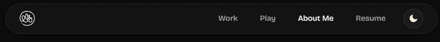
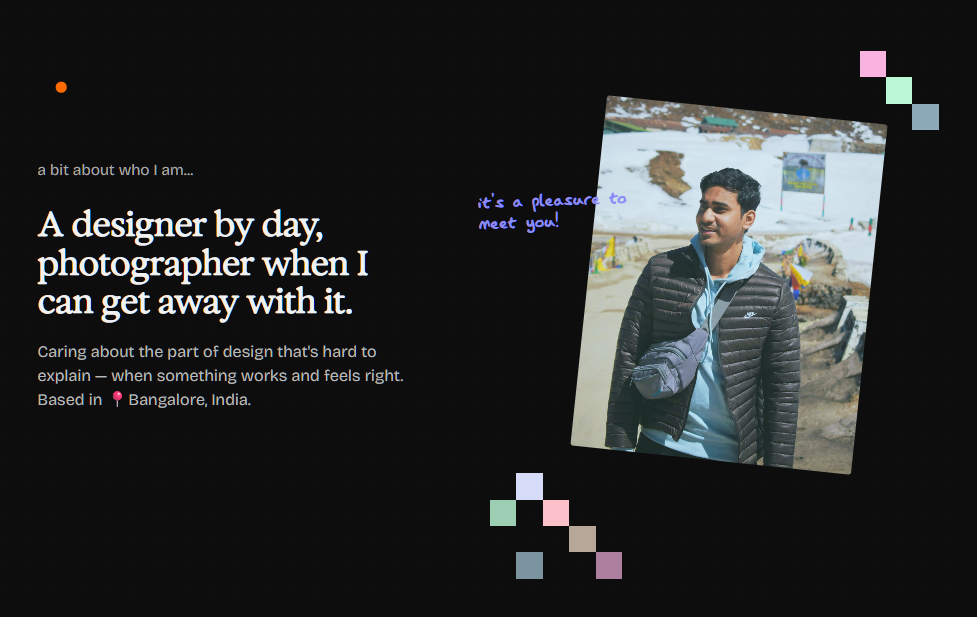
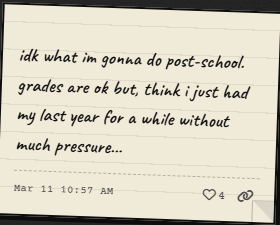
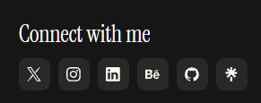

# Portfolio Website — Design Doc

Source notes: `Obsidian-Notes/Projects/Portfolio Website.md`. Architecture decisions referenced here are recorded in full in `docs/adr/`. Domain terms (Visitor Gallery, Drawing Name, Send Me a Message, etc.) are defined in `CONTEXT.md` — this doc assumes that vocabulary.

## Requirements

Original ask:

- Home
- About
- Projects
- Now
- Things I Learned
- Visitor section

Finalized nav (after design review): **About Me · Projects · Things I Learned · Visitor Gallery · Resume**. No separate "Now" page — folded into Things I Learned, which is deliberately non-technical. No Home entry either: the hero was merged into About Me, so the page opens on it. Resume downloads a PDF instead of scrolling to a section, and Send Me a Message closes the page with no nav entry of its own.

### Inspiration

- [Wall of Portfolios](https://www.wallofportfolios.in/?company=All) — reference gallery, specifically [Aditya Sadhukhan's portfolio](https://www.wallofportfolios.in/portfolios/aditya-sadhukhan/) for the Home and About Me layout.
- [Megan Yap's visitor gallery](https://meganyap.me/visitor-gallery) — origin of the Visitor Gallery idea: an AI model guessing what a visitor drew, on a drawable canvas.
- Light/dark mode toggle concept from notes ("pixel army attacks each component to turn it to the dark side or light side") — **considered and dropped**: the site is single-theme (dark only, see Color Palette below), so there's no toggle to animate.
- [joseph.cv](https://joseph.cv/) — liked the library/archive feel and overall structural scheme.
- [daniel.pizza](https://www.daniel.pizza/) — liked the color choices.
- [kwon.nyc/about](https://kwon.nyc/about/) — has a blog, injects a lot of personality; also runs a `/now` page (see [nownownow.com](https://nownownow.com/about)) — the "Now" page idea from this reference was ultimately not carried into the requirements.
- [dhrumil.ca](https://dhrumil.ca/) — has a "Things I Learned" page ([dhrumil.ca/today](https://dhrumil.ca/today)).
- [upstatement.com](https://upstatement.com/) — general studio-site reference.

---

## Technical Architecture

- **Frontend:** Vite + React + TypeScript SPA. No Next.js/SSR — the site is shared primarily via direct link (resume, LinkedIn, email), not discovered via search, so SEO isn't a driver worth the added complexity.
- **Backend:** Supabase (Postgres + Edge Functions) — the only backend the site needs.
- **Visitor Gallery inference:** `sketch-oracle`'s existing quantized `.tflite` model runs client-side in the browser via a WASM TFLite/LiteRT runtime. No server-side model hosting. See [ADR 0001](docs/adr/0001-client-side-sketch-oracle-inference.md).
- **Writes:** Both the Visitor Gallery submission and the Send Me a Message email go through a Supabase Edge Function rather than a direct client insert, so submissions can be rate-limited. See [ADR 0002](docs/adr/0002-edge-function-gated-writes.md).

## Nav Bar

- Persistent top nav bar: logo mark on the left, nav links centered-right (**About Me · Projects · Things I Learned · Visitor Gallery · Resume** — literal labels, not the "Work/Play" shorthand shown in the reference image).
- No Home link — the hero is the top of About Me, so a Home entry would scroll to the same place About Me does.
- No theme toggle — the reference's moon icon doesn't carry over, since the site has one theme.
- Active link is bolded/full-brightness white; inactive links sit in a dimmer gray so the current section is obvious at a glance. An IntersectionObserver scroll-spy drives this across the four scrollable sections.
- **Resume is the exception:** it downloads `public/resume.pdf` rather than scrolling anywhere, so it sits outside scroll-spy and is styled in the lavender accent with a trailing `↓` — the one item in the bar that *does* something rather than *goes* somewhere.
- Nav bar floats as a pill with slightly rounded corners against the near-black page background — reads as a translucent dark glass bar.
- Reference layout: [Aditya Sadhukhan's portfolio](https://www.wallofportfolios.in/portfolios/aditya-sadhukhan/).

## About Me

- **The hero and the bio are one section.** There is no Home block above it — the page opens directly on About Me, which carries the only `<h1>` on the page: "Hi, I'm Richie."
- Heading stack, top down: a small lowercase eyebrow ("a bit about who I am..."), the `<h1>`, then the tagline "I chase pretty things — sunsets mostly — whenever I can get away with it." set bold at medium size, then plain-weight body copy. The tagline carries the personality, so it outranks the body visually without competing with the headline.
- Tone throughout stays playful and personal rather than resume-style; the resume itself is a download, not prose.
- Content to adapt for Richie: chases pretty things (sunsets especially), based in Orange County, CA.
- Layout: display headline and copy on the left, tilted photo on the right (like a physical photo dropped on a desk), with a handwritten-style caption ("it's a pleasure to meet you!") floating next to the photo.
- Decorative confetti of small solid-color squares scattered around the photo — a lightweight, non-literal way to bring the palette into the layout.
- Small solid accent dot near the top-left of the section as a visual anchor — use the lavender accent (see Color Palette), not the orange shown in the reference image.
- Reference layout: same [Aditya Sadhukhan portfolio](https://www.wallofportfolios.in/portfolios/aditya-sadhukhan/).

## Projects

Simple cards, not case studies — title, one-line description, tech tags, links out to GitHub/live demo. Initial project list:

- DermCat
- rag-for-neanderthals
- Frogodoro

Styling borrows the same dark background + accent-square language used in Home/About.

## Things I Learned

Non-technical, evergreen log page. Format inspiration: [dhrumil.ca/today](https://dhrumil.ca/today).

### Weekly rail

- One bounded card per week rather than a single long vertical list: a horizontally scrolling rail, newest week on the left, so scrolling rightwards walks backwards in time.
- Each card shows a week label ("Week 1") and its date range in small uppercase mono, then a short list of entries.
- An entry is a title, optionally linked, plus an optional source tag in parentheses (video / blog / book / paper) and an optional em-dash note. Entries with no link render as plain text — a thought doesn't need a citation.
- Week numbers are Richie's own log numbering (Week 1 = the first week of the log), not ISO week numbers. Weeks run Sunday–Saturday.
- Cards share a height via flex stretch, so each week wants roughly 3–6 entries; one very long week stretches every other card with it.
- Arrow buttons scroll exactly one card per press and disable at each end. They're hidden below 640px, where the rail is thumb-scrolled directly — which is why the rail itself is focusable and keyboard-scrollable, with its own focus ring.
- The rail bleeds to the viewport edge on narrow screens (negative page-gutter margin with matching padding) so cards read as continuing off-screen rather than stopping short of it.

### Dropped: Watched/Rewatched and On Repeat

- The movie-poster row and the music "On *repeat*." row were both cut, along with the cream "paper" background they implied. `docs/design-assets/music-movie-section.png` is kept as historical reference only.
- The "Watched, *rewatched*." / "On *repeat*." display-type treatment — large serif with the second word italicized — survives elsewhere: it's the same device used by the "Things I *learned*." and "Connect *with me*" headings.

## Visitor Gallery

New nav page, not present in the original design pass — added after design review.

- Visitor draws on a canvas.
- `sketch-oracle` (a CNN Richie already built, guessing from a fixed ~100-word benign object vocabulary — airplane, cat, star, etc.) classifies the sketch, entirely client-side.
- The guessed noun is combined with a random adjective into a **Drawing Name** (e.g. "Generous Zebra") and shown to the visitor.
- The drawing is submitted as **stroke data** (not a flat image) via a Supabase Edge Function — this lets the gallery replay the drawing being drawn as a short animation, rather than showing a static thumbnail.
- Submissions land in a **public, browsable gallery** — other visitors can see past Drawing Names and watch them redraw.
- Each gallery entry has a lightweight **flag/report button** as a moderation backstop, since the drawn image (not just the guessed label) is visible to other visitors and the label alone can never be offensive.
- The Edge Function rate-limits submissions per visitor to deter spam.

## Resume

No section on the page — the nav's Resume entry downloads the PDF directly.

- The link points at `public/resume.pdf` with a `download` attribute. **That file does not exist yet**; until it's dropped in, Vite's SPA fallback serves `index.html` and the browser saves that HTML under the name `resume.pdf`.
- Styled apart from the other nav links (lavender, trailing `↓`) so it reads as an action rather than a destination, and excluded from scroll-spy since there's no section to highlight.
- This replaced an earlier on-page Resume section; the end-of-page slot it used to hold now belongs to Send Me a Message.

## Send Me a Message

- **Closing section**, in the slot the on-page Resume block used to hold — last thing in `<main>`, above the footer. Heading, sub-line and post-it are centered so the page ends on the note rather than trailing off to the left. No nav entry; you arrive by scrolling.
- Private only — the post-it is just the interface, not a public wall. No other visitor ever sees a submitted note.
- Visitor writes a message with contact info underneath; submitting sends Richie an email via a Supabase Edge Function. No database, no admin inbox — email is the only record.
- Visual: sticky/post-it paper background, slightly rotated, drop shadow to feel physically stacked. Message text in a handwritten-style font, dark navy ink color.
- The reference image's heart/reply icons don't carry over functionally — there's nothing public to like or reply to. Replace with a simple submit + "sent" confirmation state.
- Contact info needs its own line, distinct from the message body, so replies are possible.
- Focused fields get a navy ring in the post-it's own ink color rather than the site's lavender accent — lavender is far too light to read against the yellow paper.

## Bottom Bar (Footer)

- "Connect *with me*" heading in serif with the second half italicized, in **flat white**. The lavender→pink gradient shown in the reference was dropped by request — the pastels are confetti-only now, and nothing in the footer competes with the icon row.
- Row of square, rounded-corner icon chips (dark charcoal fill) — icons are white/off-white glyphs on the chip. Each chip carries an `aria-label`, since they're icon-only.
- **Three links only: Email, GitHub, LinkedIn.** X/Twitter and Instagram were dropped; the reference image's Behance and asterisk/link chips were never carried over.

---

## Color Palette

The site is **single-theme: dark only**, throughout every section (including Send Me a Message, which the original reference images showed on a lighter/warmer background). No light mode, no theme toggle. Pastel "confetti" squares are the only color accents, layered on the dark base.

### Core neutrals

| Swatch | Hex (approx.) | Usage | Why |
|---|---|---|---|
| Near-black | `#0D0D0D` – `#141414` | Every section's background, site-wide | Reads as premium/editorial rather than flat pure black (`#000`); keeps enough warmth that photos and colored accents don't look harsh against it; used consistently instead of switching to a lighter background per section. |
| Sticky-note yellow | `#FDF6D8` – `#FBEFA0` | Post-it note background only | A literal object color (a real sticky note), not a theme accent — it's a small, isolated element sitting on the dark page, not a full light section. |
| Ink navy | `#1F2A44` | Post-it note text | High contrast on yellow paper while avoiding harsh pure black, consistent with a ballpoint-pen look. |
| Off-white / light gray text | `#D9D9D9` – `#A0A0A0` | Body copy & inactive nav links | Keeps hierarchy: full white for headlines/active state, dimmed gray for secondary/inactive content. |
| Dot grid | `rgba(255, 255, 255, 0.09)` on the near-black base | Page background texture, on a 24px grid | Graph-paper dots instead of a flat field — enough texture to read as paper without becoming a pattern you notice. Drawn as a `radial-gradient` with a hard stop (`transparent 0`, not a second length) so each dot stays a crisp point on high-DPI screens instead of a blurry smudge. |

### Accent colors

| Swatch | Hex (approx.) | Usage | Why |
|---|---|---|---|
| Lavender / periwinkle | `#B7A9F0` | Functional accent: handwritten captions, links/buttons/active states, the Resume download, About Me anchor dot, focus rings on dark backgrounds | Promoted to the site's one functional accent (replacing the rejected orange) — it already did double duty across the reference images, so it reads as already "Richie's" color rather than an arbitrary pick. |
| Soft pink | `#F5A9C4` – `#F4B6C2` | Confetti squares | Pastel enough to sit on the dark background without competing with content. |
| Mint green | `#A8E6C1` | Confetti squares | Rounds out the pastel trio (pink/lavender/mint) used purely decoratively — no functional meaning, just texture. |
| Slate blue-gray | `#8A9BA8` | Confetti squares | A muted, cooler pastel that keeps the confetti from feeling too candy-colored against the near-black background. |
| Dusty mauve / tan | `#C9A88A`, `#B08CA0` | Confetti squares | Rounds out an earthy sub-set of the palette — pairs with the photo tones in About Me (jacket, skin tones, snow scene) so the decoration doesn't fight the photo. |

**Dropped from the original pass:** the orange anchor-dot accent and the terracotta/warm-red accent tied to a cream "paper" section — both rejected in design review in favor of staying fully dark with lavender as the one functional accent.

### Notes on the palette

- The confetti pastels (pink, mint, lavender, slate, mauve) are intentionally desaturated so no single one competes with photography or reads as a "brand color." Use them only as small square accents, never as large fills.
- Lavender is the *only* color used functionally (links, buttons, active/hover states) — everything else in the accent set stays decorative-only, so interactive elements stay visually consistent across the site.
- Focus rings use lavender on the dark background, but ink navy on the post-it — lavender on yellow paper doesn't clear the 3:1 contrast a focus indicator needs. One accent, two surfaces, so the rule has to bend once.
- Real content (the About Me photo, project screenshots, visitors' own drawings) naturally carries its own full color — that's expected and not something to suppress; the "no orange/terracotta/cream" rule is about the *theme's* chosen accents, not about desaturating photography or licensed artwork.
